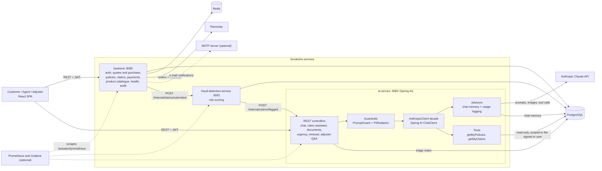

# Suraksha Insurance

## Brief about the application

Suraksha is a full-stack insurance platform for the Indian market, covering **twelve insurance types** (health, life,
car, two-wheeler, home, travel, personal accident, cyber, gadget, pet, business and marine cargo).
Customers can register (with optional multi-factor authentication), get a price and buy a policy online, pay premiums
through Razorpay, file and track claims (with supporting documents), cancel or change a policy, raise grievances and
receive renewal reminders. Agents and claims adjusters get their
own workspaces on the same platform.

Every claim is automatically screened for fraud risk by a separate service, and an AI layer built on **Spring AI**
(using Anthropic Claude) helps both customers and staff: a support chatbot that can look up your own policies and
claims, a "describe what happened" claim-filing assistant, bill/photo reading, plan comparison, renewal explanations,
and briefing notes for adjusters.

The guiding rule of the platform: **AI assists, people and deterministic rules decide.** Nothing in the AI layer can
approve, reject or pay a claim.

---

## Application stack

| Layer | Technology |
|---|---|
| Frontend | React (Vite) + Tailwind CSS, served on port 5173 in local dev |
| Backend API | Spring Boot, Java 21 (port 8080): authentication, policies, claims, payments, the insurance product catalogue, health-insurance features, grievances, notifications, audit log |
| Fraud detection service | Spring Boot, Java 21 (port 8081): scores every submitted claim and flags risky ones |
| **AI service** | **Spring Boot 3.5 + Spring AI 1.1, Java 21 (port 8082)** with the Anthropic Claude model |
| Database | PostgreSQL (shared by the three services); schema changes are versioned Flyway migrations in `backend/src/main/resources/db/migration` |
| Session store | Redis (refresh tokens) |
| Payments | Razorpay (Orders API + signature-verified webhook) |
| Security | JWT access tokens, TOTP multi-factor authentication, device fingerprinting, login-attempt lockout, rate limiting, CSRF protection, field-level encryption for PAN / Aadhaar / diagnosis, internal service token between services |
| Observability | Micrometer metrics at `/actuator/prometheus` on every service; optional Prometheus and Grafana (`docker compose --profile monitoring up`, dashboard in `monitoring/`) |
| Continuous integration | GitHub Actions (`.github/workflows/ci.yml`): build and test each service, build the frontend, build the Docker images |
| Packaging and deployment | Docker Compose (local), Kubernetes manifests with deny-by-default network policies (`k8s/`), `render.yaml` |

### Insurance types

Every insurance line is described once, in the backend's `ProductRegistry`: its plan, price, claim-form fields and
document checklist. The catalogue is served at `GET /api/products`. The landing page and the claim forms are built
from it, so adding a line means adding a definition, not new screens.

| Category | Types |
|---|---|
| Health & Life | Health (dedicated claim flow), Life (term) |
| Vehicle | Car (`MOTOR`), Two-wheeler (`TWO_WHEELER`) |
| Home & Property | Home & property (`HOME`) |
| Travel & Accident | Travel (`TRAVEL`), Personal accident (`PERSONAL_ACCIDENT`) |
| Digital & Devices | Cyber (`CYBER`), Gadget (`GADGET`), Pet (`PET`) |
| Business | Business (`BUSINESS`), Marine cargo (`MARINE_CARGO`) |

How it works:

- **Claim details** for every line except health are validated on the server against that line's field definitions
  (`ClaimDetailsValidator`): required fields, dates, numbers, allowed options, unknown keys rejected, and conditional rules
  such as "a police report number is required for a theft claim". They are stored as JSON on the claim (`claims.details`).
- **What is insured** (vehicle registration, trip destination, property address) is stored as JSON on the policy
  (`policies.attributes`) and shown on the policy card.
- **Health** keeps its own flow: insured members, an itemised bill and the deterministic assessor.
- **Recommendations** offer at most three unowned plans, related cover first (for example personal accident alongside a
  vehicle policy), so the number of model calls doesn't grow with the catalogue.

Plans, prices and claim fields are illustrative. Confirm them, together with IRDAI-approved product terms, with your
product, actuarial and compliance teams before real use. Premiums and payouts are never produced by the AI layer.

**Adding another type:** add the value to `PolicyType` (backend) and `PolicyTypeView` (ai-service), add a
`ProductDefinition` in `ProductRegistry`, a quote form in `QuoteRegistry` with its rating rule in `PremiumCalculator`,
and a plan in the ai-service `PlanCatalog`. The unit tests (`ProductRegistryTest`, `QuoteServiceTest`, `PlanCatalogTest`)
fail if a type is missing any of them. No schema change is needed: the type and status columns have no CHECK constraint.

**Upgrading an existing database:** nothing to run by hand. Flyway is on, treats an existing database as version 1, and
`V2__drop_enum_check_constraints.sql` removes the old CHECK constraints that Hibernate created on `policies.type` and
`policies.status`. The new JSON columns are added automatically.

### Platform features

**Buy a policy online.** The customer picks a type, answers that type's short form (for example age and sum insured for
health, vehicle value and age for a car, trip length and region for travel), and sees a priced breakdown that adds up
line by line. Buying creates the policy as `PENDING_PAYMENT`; it becomes `ACTIVE` when the payment clears (the mock
payment path or the signature-verified Razorpay webhook). The price is always recomputed on the server, so a price sent by
the browser is ignored. Rating is rule-based in `PremiumCalculator`; the AI never prices anything. Only identifying
answers (registration number, destination, address) are kept on the policy; rating-only answers such as age or smoker
status are not stored.

**Change or cancel a policy.** Cancelling shows a refund estimate first: the premium for the unused days minus a configurable
cancellation fee (`POLICY_CANCELLATION_FEE_PERCENT`, default 10), nothing if a claim has been paid, and it is blocked while
claims are still in progress. The refund amount is recorded on the policy; no money is moved automatically. Life
policyholders can set or change a nominee. Both actions are written to the audit log.

**Claim documents.** After filing a claim, customers upload photos, bills and estimates against it, with each type's document
checklist shown on the claim form. Adjusters open them through an audit-logged endpoint (identity documents are excluded).

**Adjuster workbench.** `GET /api/adjuster/claims/workbench` returns open claims ranked by fraud risk, time open against a
48-hour review target, and whether anyone has picked them up. Adjusters self-assign claims. The ranking only orders the
queue; it never decides a claim.

**Fraud rules per insurance type.** On top of the existing amount and open-claims rules, the fraud service now flags:
an incident outside the policy period, theft or burglary within 30 days of the policy starting, a claim reported more than
30 days after the incident, the same vehicle, device or shipment appearing on another claim (stronger if the incident date is
the same), a third claim of the same kind on one policy (for example repeated flight-delay claims), and a cyber fraud claim
that was not reported to the cyber crime portal. The flags are stored on the claim and explained in plain language to the adjuster.

**Notifications by e-mail.** Every in-app notification (claim status changes, renewal reminders, policy activation) can also
be sent by e-mail. It is off by default; set `EMAIL_NOTIFICATIONS_ENABLED=true` and the standard Spring mail settings
(`SPRING_MAIL_HOST`, `SPRING_MAIL_PORT`, `SPRING_MAIL_USERNAME`, `SPRING_MAIL_PASSWORD`). Sending is best effort and never slows
the request that triggered it.

### Spring AI in the application

All AI features live in `ai-service` and go through Spring AI's `ChatClient`.

| Spring AI feature | Where it is used |
|---|---|
| **ChatClient** (Anthropic starter) | `AnthropicClient` is a thin facade over `ChatClient`. Every AI feature uses it, and it keeps the "no API key, return a clearly labelled fallback" behaviour so the whole stack runs without a key. |
| **Structured output** (`.entity(...)`) | Claim-filing assistant (`ClaimDraft`), document field extraction (`ExtractedDocument`) and urgency triage (`UrgencyAssessment`) map the model's reply straight onto Java records instead of hand-parsing JSON. |
| **Chat memory** (`MessageChatMemoryAdvisor`, JDBC repository) | The support chatbot remembers the conversation. History is stored in PostgreSQL, namespaced per signed-in user, so it survives restarts and is shared across replicas. |
| **Tool calling** (`@Tool`) | The chatbot can call read-only tools, `getMyPolicies` and `getMyClaims`. The customer id comes from the validated JWT, never from the model, and fraud or triage data is never returned. |
| **Advisors** (`CallAdvisor`) | `UsageLoggingAdvisor` logs model, token usage and latency for every call. |
| **Multimodal input** | Claim photos and bills are sent to the model as image media for description and field extraction. |
| Streaming | The English chat streams text as it is written (`/api/ai/chat/stream`, server-sent events). The closing event carries the guard-checked text, so a streamed answer can never keep approve or deny language. |
| Regional languages | The chat replies in Hindi, Telugu, Tamil, Kannada, Malayalam, Marathi, Bengali or Gujarati. The model answers in English first, the guard checks that text, and only then is it translated. |
| Usage limits | Per-user request limits per minute and per day (`AI_REQUESTS_PER_MINUTE`, `AI_REQUESTS_PER_DAY`) protect the AI budget. Counters are per replica. |
| Similar claims | Adjusters can ask for the closest past claims of the same type (`/api/ai/similar-claims/{claimId}`). This compares the wording of descriptions; it is not an embedding search and says nothing about whether a claim is genuine. |
| Catalogue-aware AI | Recommendations, plan comparison, the support chatbot and the claim assistant work across all twelve types. Recommendations are capped and ranked by related cover. |
| Guardrails around Spring AI | `PromptGuard` (untrusted-content wrapping and a check that blocks approve/deny language) and `PiiRedactor` (masks card, Aadhaar, PAN, e-mail and phone numbers before anything reaches the model or chat memory). |

Configuration: set `ANTHROPIC_API_KEY` (and optionally `ANTHROPIC_MODEL`) on `ai-service`. Without a key, every AI
feature returns a labelled fallback.

### Application architecture

**How a claim flows through the system**

1. The customer files a claim, by hand or with the AI claim assistant. `backend` saves it and notifies `fraud-detection-service`.
2. `fraud-detection-service` scores the claim against policy coverage, open-claim signals and the rules for that insurance type, and writes the score and the flags that fired back to the database.
3. Claims above the risk threshold are sent to `ai-service`, which writes a short triage note for the adjuster (facts and what to check, never a decision).
4. A human adjuster picks the claim from a prioritised queue, reviews it and its documents, can ask the AI questions about claim records or look at similar past claims, and makes the decision.

---

## Configuration

| Setting | Service | Purpose |
|---|---|---|
| `ANTHROPIC_API_KEY`, `ANTHROPIC_MODEL` | ai-service | Enables the AI features; without a key every feature returns a labelled fallback |
| `AI_REQUESTS_PER_MINUTE`, `AI_REQUESTS_PER_DAY` | ai-service | Per-user chat limits (defaults 20 and 200) |
| `APP_CORS_ORIGIN` | backend, ai-service | The web app's origin; the browser calls both services directly with its cookie |
| `POLICY_CANCELLATION_FEE_PERCENT` | backend | Share of the unused premium kept on cancellation (default 10) |
| `EMAIL_NOTIFICATIONS_ENABLED`, `EMAIL_FROM`, `SPRING_MAIL_*` | backend | E-mail copies of notifications (off by default) |
| `APP_PAYMENTS_MOCK_ENABLED`, `RAZORPAY_*` | backend | Payment gateway; mock payments are for local demos only |
| `GRAFANA_ADMIN_PASSWORD` | monitoring profile | Grafana admin password for local use |

## Known limitations

- All premium rates, plan names and claim fields are illustrative. Real products need filed rates and IRDAI-approved terms.
- Not built: savings and pension products (endowment, ULIP, annuity), crop, group and micro insurance, critical-illness and
  top-up health variants, commercial vehicles, auto-renewal (UPI AutoPay), SMS and WhatsApp notifications, policy-document
  retrieval (RAG), and a shared Maven module for the type list (it is kept in sync by hand across the backend and ai-service,
  with tests that catch a missing definition within each service).
- Refunds are calculated and recorded but not paid out automatically.
- The adjuster workbench is an API; there is no staff screen for it in the web app yet.
- Chat usage limits are per replica. Move the counters to Redis for one shared limit across replicas.
- The guardrail tests exercise the code-level checks only. They do not call a live model, and there is no Testcontainers
  integration suite yet.

## Questions and answers

### 1. What is this application all about?

Suraksha is a digital insurance platform that takes a policyholder from buying and managing a policy to filing,
tracking and settling a claim, across health, life, vehicle, home, travel, personal accident, cyber, gadget, pet,
business and marine cargo cover. It also gives insurer staff the tools to review claims quickly.

For customers it covers registration and login (with optional MFA), policies, claims, premium payments through
Razorpay, grievances and renewal reminders. Health policies add insured members, a coverage tracker (sum insured,
used, reserved, remaining, plus room-rent cap, co-pay and waiting periods) and an itemised hospital-bill claim.

Behind that sits a fraud-screening service and an AI service. The AI service helps with everyday questions,
drafting claims, reading documents and preparing adjuster briefings, but it never makes the decision.

This repository is a reference implementation. Plans, premiums and seed data are illustrative, and the business
assumptions in the health-claim assessor should be confirmed with your product and compliance teams before any real use.

### 2. Why is this application different from other applications?

- **AI assists, it doesn't decide.** Prompts forbid approval or rejection language, and the code enforces it: replies that sound like a decision are replaced with a safe message. Health-claim estimates come from a deterministic assessor that produces notes for the adjuster and never approves or rejects.
- **The assistant works on your real data, safely.** The chatbot uses Spring AI tool calling to read your policies and claims. It is scoped to the signed-in user by the server, and it cannot see internal fraud scores or triage notes.
- **Explainable fraud screening.** Risk scores come from transparent rule-based signals, and the AI explains those signals to the adjuster in plain language instead of acting as a black box.
- **Privacy by design.** PAN, Aadhaar and diagnosis are encrypted at rest. Card, Aadhaar, PAN, e-mail and phone numbers are masked before text goes to the model or into stored chat history. Adjuster access to health claim details is written to an audit log.
- **Built for Indian insurance.** It uses rupee amounts, Razorpay payments, PAN and Aadhaar handling, and health-plan rules such as room-rent proportionate deduction, co-pay and waiting periods.
- **Prices you can read.** Premiums come from transparent rating rules and are shown as a breakdown that adds up, never produced by a model. The server recomputes the price at purchase.
- **One platform, many lines of cover.** Claim forms, document checklists and validation come from a single product catalogue, so each line asks only for what it needs (a police report number for theft, a trip's dates for a travel claim) and a new line doesn't need new screens.
- **Security is layered.** MFA, device fingerprinting, login lockout, rate limiting, CSRF protection, service-to-service tokens and deny-by-default Kubernetes network policies.
- **It degrades gracefully.** With no AI key configured, every feature falls back to a clearly labelled response, so the platform keeps working.

### 3. Why should an end user use this application compared to other applications?

- **One place for everything.** Health, life, vehicle, home, travel, accident, cyber, gadget, pet and business cover, plus claims, payments, grievances and renewal reminders, live in one app, so you don't need separate portals or paperwork.
- **Buy, change and cancel online.** You get a price before you pay, can set a nominee on a life policy, and see your refund before you cancel.
- **Answers in your language.** The assistant replies in nine Indian languages, and the "no claim decisions" check always runs before translation.
- **A claim form that fits your cover.** Filing a claim asks only what that type of policy needs, tells you which documents to keep ready, and flags a missing detail before you submit.
- **Filing a claim is easier.** Describe what happened in your own words and the assistant drafts the claim form for you. It asks follow-up questions instead of guessing missing details. Upload a bill or photo and the key fields are read for you.
- **Get answers about your own policies and claims any time.** The in-app assistant looks up your cover and your claims' current status. It doesn't guess about outcomes and points you to a human when you need one.
- **You can see where you stand.** For health policies, the coverage tracker shows what is used, what is reserved by pending claims and what remains, along with the room-rent, co-pay and waiting-period terms that affect a claim.
- **Plain-language help.** Plan comparison against your situation and clear renewal explanations help you understand your cover before you decide.
- **Fair, human-made decisions.** Claims are decided by a claims adjuster. Fraud screening and AI notes only help route and prepare the claim faster.
- **Your sensitive data is handled carefully.** Your identity and medical details are encrypted, they are masked before reaching the AI model, and your chat history is visible only to you. You can also clear it with "New chat".
