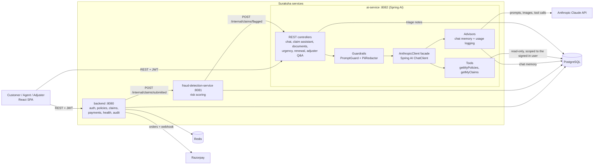

# Suraksha Insurance

## Brief about the application

Suraksha is a full-stack insurance platform for the Indian market, covering **health, motor and life** policies.
Customers can register (with optional multi-factor authentication), view their policies, file and track claims,
pay premiums through Razorpay, raise grievances and receive renewal reminders. Agents and claims adjusters get their
own workspaces on the same platform.

Every claim is automatically screened for fraud risk by a separate service, and an AI layer built on **Spring AI**
(using Anthropic Claude) helps both customers and staff: a support chatbot that can look up your own policies and
claims, a "describe what happened" claim-filing assistant, bill/photo reading, plan comparison, renewal explanations,
and briefing notes for adjusters.

The guiding rule of the platform: **AI assists, people and deterministic rules decide.** Nothing in the AI layer can
approve, reject or pay a claim.

---

## Application stack

| Layer | Technology |
|---|---|
| Frontend | React (Vite) + Tailwind CSS, served on port 5173 in local dev |
| Backend API | Spring Boot, Java 21 (port 8080): authentication, policies, claims, payments, health-insurance features, grievances, notifications, audit log |
| Fraud detection service | Spring Boot, Java 21 (port 8081): scores every submitted claim and flags risky ones |
| **AI service** | **Spring Boot 3.5 + Spring AI 1.1, Java 21 (port 8082)** with the Anthropic Claude model |
| Database | PostgreSQL (shared by the three services) |
| Session store | Redis (refresh tokens) |
| Payments | Razorpay (Orders API + signature-verified webhook) |
| Security | JWT access tokens, TOTP multi-factor authentication, device fingerprinting, login-attempt lockout, rate limiting, CSRF protection, field-level encryption for PAN / Aadhaar / diagnosis, internal service token between services |
| Packaging and deployment | Docker Compose (local), Kubernetes manifests with deny-by-default network policies (`k8s/`), `render.yaml` |

### Spring AI in the application

All AI features live in `ai-service` and go through Spring AI's `ChatClient`.

| Spring AI feature | Where it is used |
|---|---|
| **ChatClient** (Anthropic starter) | `AnthropicClient` is a thin facade over `ChatClient`. Every AI feature uses it, and it keeps the "no API key, return a clearly labelled fallback" behaviour so the whole stack runs without a key. |
| **Structured output** (`.entity(...)`) | Claim-filing assistant (`ClaimDraft`), document field extraction (`ExtractedDocument`) and urgency triage (`UrgencyAssessment`) map the model's reply straight onto Java records instead of hand-parsing JSON. |
| **Chat memory** (`MessageChatMemoryAdvisor`, JDBC repository) | The support chatbot remembers the conversation. History is stored in PostgreSQL, namespaced per signed-in user, so it survives restarts and is shared across replicas. |
| **Tool calling** (`@Tool`) | The chatbot can call read-only tools, `getMyPolicies` and `getMyClaims`. The customer id comes from the validated JWT, never from the model, and fraud or triage data is never returned. |
| **Advisors** (`CallAdvisor`) | `UsageLoggingAdvisor` logs model, token usage and latency for every call. |
| **Multimodal input** | Claim photos and bills are sent to the model as image media for description and field extraction. |
| Guardrails around Spring AI | `PromptGuard` (untrusted-content wrapping and a check that blocks approve/deny language) and `PiiRedactor` (masks card, Aadhaar, PAN, e-mail and phone numbers before anything reaches the model or chat memory). |

Configuration: set `ANTHROPIC_API_KEY` (and optionally `ANTHROPIC_MODEL`) on `ai-service`. Without a key, every AI
feature returns a labelled fallback.

### Application architecture

**How a claim flows through the system**

1. The customer files a claim, by hand or with the AI claim assistant. `backend` saves it and notifies `fraud-detection-service`.
2. `fraud-detection-service` scores the claim against policy coverage and open-claim signals and writes the score back to the database.
3. Claims above the risk threshold are sent to `ai-service`, which writes a short triage note for the adjuster (facts and what to check, never a decision).
4. A human adjuster reviews the claim, can ask the AI questions about claim records, and makes the decision.

---

## Questions and answers

### 1. What is this application all about?

Suraksha is a digital insurance platform that takes a policyholder from buying and managing a policy to filing,
tracking and settling a claim. It also gives insurer staff the tools to review claims quickly.

For customers it covers registration and login (with optional MFA), policies, claims, premium payments through
Razorpay, grievances and renewal reminders. Health policies add insured members, a coverage tracker (sum insured,
used, reserved, remaining, plus room-rent cap, co-pay and waiting periods) and an itemised hospital-bill claim.

Behind that sits a fraud-screening service and an AI service. The AI service helps with everyday questions,
drafting claims, reading documents and preparing adjuster briefings, but it never makes the decision.

This repository is a reference implementation. Plans, premiums and seed data are illustrative, and the business
assumptions in the health-claim assessor should be confirmed with your product and compliance teams before any real use.

### 2. Why is this application different from other applications?

- **AI assists, it doesn't decide.** Prompts forbid approval or rejection language, and the code enforces it: replies that sound like a decision are replaced with a safe message. Health-claim estimates come from a deterministic assessor that produces notes for the adjuster and never approves or rejects.
- **The assistant works on your real data, safely.** The chatbot uses Spring AI tool calling to read your policies and claims. It is scoped to the signed-in user by the server, and it cannot see internal fraud scores or triage notes.
- **Explainable fraud screening.** Risk scores come from transparent rule-based signals, and the AI explains those signals to the adjuster in plain language instead of acting as a black box.
- **Privacy by design.** PAN, Aadhaar and diagnosis are encrypted at rest. Card, Aadhaar, PAN, e-mail and phone numbers are masked before text goes to the model or into stored chat history. Adjuster access to health claim details is written to an audit log.
- **Built for Indian insurance.** It uses rupee amounts, Razorpay payments, PAN and Aadhaar handling, and health-plan rules such as room-rent proportionate deduction, co-pay and waiting periods.
- **Security is layered.** MFA, device fingerprinting, login lockout, rate limiting, CSRF protection, service-to-service tokens and deny-by-default Kubernetes network policies.
- **It degrades gracefully.** With no AI key configured, every feature falls back to a clearly labelled response, so the platform keeps working.

### 3. Why should an end user use this application compared to other applications?

- **One place for everything.** Policies, claims, payments, grievances and renewal reminders live in one app, so you don't need to chase separate portals or paperwork.
- **Filing a claim is easier.** Describe what happened in your own words and the assistant drafts the claim form for you. It asks follow-up questions instead of guessing missing details. Upload a bill or photo and the key fields are read for you.
- **Get answers about your own policies and claims any time.** The in-app assistant looks up your cover and your claims' current status. It doesn't guess about outcomes and points you to a human when you need one.
- **You can see where you stand.** For health policies, the coverage tracker shows what is used, what is reserved by pending claims and what remains, along with the room-rent, co-pay and waiting-period terms that affect a claim.
- **Plain-language help.** Plan comparison against your situation and clear renewal explanations help you understand your cover before you decide.
- **Fair, human-made decisions.** Claims are decided by a claims adjuster. Fraud screening and AI notes only help route and prepare the claim faster.
- **Your sensitive data is handled carefully.** Your identity and medical details are encrypted, they are masked before reaching the AI model, and your chat history is visible only to you. You can also clear it with "New chat".
